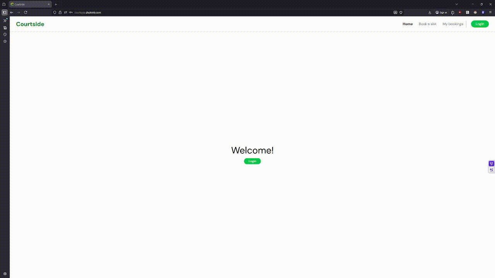

# Courtside
A full-stack court booking system for tennis, badminton, and padel, with role-based admin access, booking management, and a stats dashboard.
Available at: [courtside.shotcrib.com](https://courtside.shotcrib.com)
--------------------------------------------------------
## Demo
### User flow


### Admin flow


## Tech Stack


## Features
- Website to book tennis, badminton and padel courts.
- Custom JWT-based authentication, without third-party auth providers.
- View your upcoming and past bookings.
- Role-based admin access enforced at the database level.
- Admin panel to view and manage bookings.
- Admin stats overview of bookings.

## Setup
### Prerequisites
- Docker

### Installation
```bash
git clone https://github.com/ShotCrib77/sports-hall-booking-system courtside
cd courtside
cp .env.example .env
docker compose up -d --build
```
Don't forget to fill in the .env file! See .env.example for reference.

## Notes
### Double booking prevention
Initially I designed the bookings table with a composite primary key of `court_id`, `booked_date` and `booked_time`. This broke when I added booking cancellations since I wanted to keep cancelled bookings in the table rather than delete them, but that meant a cancelled slot would block future bookings for the same time. To solve this I added a unique constraint on a computed `active_slot` column that's a combination of the 3 aforementioned values, but it's only set for confirmed bookings. Any other booking status will have a `NULL` `active_slot` and therefore gets ignored by the constraint.

### Authentication
Previously to this project I wasn't aware of NextAuth, so implementing the auth myself using JWT tokens wasn't very deliberate. But I'm glad I did because it gave me a much better understanding of how authentication works than what using a library would have.

### Hosting
Rather than just pushing to Vercel I wanted to actually learn how hosting works, so I set up a VPS with Nginx as a reverse proxy and Docker Compose to manage the services. I also wanted to get a base understanding of how Nginx rate limiting worked so I set up rate limits for 60 requests/min globally with stricter limits on `/login` and `/register` to make brute forcing a bit harder.

## License
[MIT](./LICENSE)